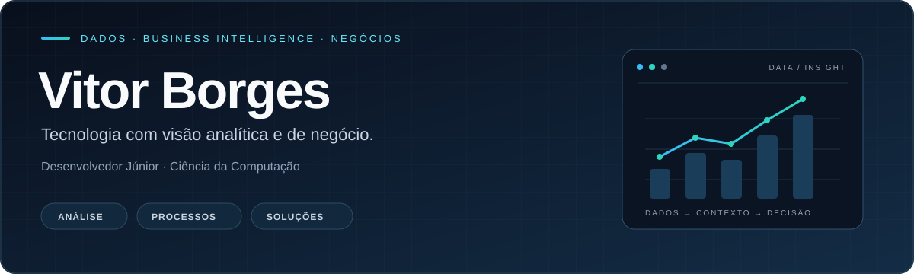

  

  <strong>Dados · Business Intelligence · Análise de Negócios de TI</strong> 
  Python e SQL como base. Projetos como demonstração prática.

  
  
  

<a href="mailto:vitor.apborges@gmail.com">vitor.apborges@gmail.com</a>

  <a href="#sobre-mim">Sobre mim</a> ·
  <a href="#competências-técnicas">Tecnologias</a> ·
  <a href="#projetos">Projetos</a> ·
  <a href="#dados--negócios">Dados &amp; negócios</a> ·
  <a href="#atividade-no-github">GitHub</a>

---

## Sobre mim

Sou **Vitor Borges**, desenvolvedor júnior e estudante de **Ciência da Computação no CEUB**, com foco de carreira em **Dados, Business Intelligence e Análise de Negócios de TI**.

Tenho domínio de **Python, SQL, JavaScript, HTML e CSS**. Nos meus projetos acadêmicos, essa base aparece em análise exploratória, classificação de dados e interfaces conectadas a APIs.

Meu interesse está em entender necessidades de negócio, organizar informações e comunicar resultados que apoiem decisões. Tenho abertura a diferentes ferramentas e plataformas, conforme o problema e o contexto de cada projeto.

## Competências técnicas

   &nbsp;&nbsp;&nbsp;
   &nbsp;&nbsp;&nbsp;
   &nbsp;&nbsp;&nbsp;
   &nbsp;&nbsp;&nbsp;
  

<strong>Python &nbsp; · &nbsp; SQL &nbsp; · &nbsp; JavaScript &nbsp; · &nbsp; HTML &nbsp; · &nbsp; CSS</strong>

- **Python** — programação, automação de tarefas e manipulação de dados.
- **SQL** — consultas, filtros, agregações e relacionamento entre dados.
- **JavaScript** — lógica de programação e interatividade em aplicações web.
- **HTML e CSS** — estruturação de páginas e apresentação de interfaces.

### Ferramentas para Análise e Visualização de Dados

Bibliotecas aplicadas no meu [projeto de classificação com KNN](https://github.com/vitorborges10/Knn_implementacao_1):

  
  
  
  

## Projetos

### 01 &nbsp; Classificação de dados com KNN

**Análise exploratória · Preparação de dados · Aprendizado supervisionado**

Projeto acadêmico de classificação de espécies do conjunto **Iris** a partir das medidas das flores. O código reúne exploração visual com Seaborn, separação entre treino e teste, padronização dos atributos e classificação com scikit-learn.

**O que está implementado:** avaliação por acurácia, matriz de confusão e relatório de classificação, além de um gráfico comparando diferentes valores de `k`.

`Python` `Pandas` `Seaborn` `Matplotlib` `scikit-learn`

**[Explorar código →](https://github.com/vitorborges10/Knn_implementacao_1)**

---

### 02 &nbsp; Spotify Wrapped

**Integração de API · Dados musicais · Interface interativa**

Projeto integrador desenvolvido **em equipe**, inspirado no Spotify Wrapped. A aplicação conecta-se à Spotify Web API para apresentar informações musicais do usuário em uma experiência visual.

**O que o projeto apresenta:** playlists, músicas mais ouvidas e uma composição visual de álbuns, com autenticação no serviço e navegação em React.

`JavaScript` `React` `HTML` `CSS` `Spotify Web API`

**[Explorar projeto e capturas de tela →](https://github.com/vitorborges10/spotify-wrapped)**

  

## Dados & Negócios

Meu direcionamento profissional conecta três áreas:

- **Análise e BI:** indicadores, dashboards e comunicação de resultados para apoiar decisões.
- **Processos e requisitos:** compreensão de demandas, mapeamento com BPMN e identificação de melhorias.
- **Soluções de TI:** uso de programação e dados para aproximar necessidades de negócio e implementação.

## Atividade no GitHub

  
  

---

### Vamos conversar?

Aberto a oportunidades em **Dados, BI e Análise de Negócios de TI**. 
Entre em contato para conversar sobre projetos e colaboração.

**[LinkedIn](https://www.linkedin.com/in/vitorborges10/)** &nbsp; · &nbsp; **[E-mail](mailto:vitor.apborges@gmail.com)**

